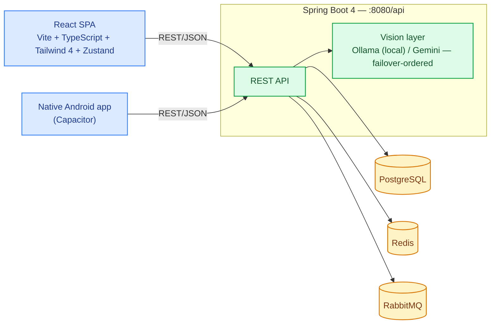

# BOCollections

A self-hosted, smart physical-media collection manager. Track books, magazines, CDs, vinyl,
cassettes, DVDs, Blu-ray, VHS, video games, and anything else that lives on a shelf — with
AI-assisted bulk scanning at home and an in-store "do I already own this?" thrifting mode.
Inspired by Libib, built to go further.

## Documentation

- **[docs/product-overview.md](./docs/product-overview.md)** — what the app is for and why its
  features look the way they do (start here).
- **[docs/architecture.md](./docs/architecture.md)** — technical reference: system diagram, data
  model, backend/frontend patterns.
- **[docs/deployment.md](./docs/deployment.md)** — release pipeline, Proxmox LXC install, full
  configuration reference, backups.
- **[docs/specs/](./docs/specs)** — pre-implementation design docs for specific features.

## What it does (current)

- **Catalogue** — a shared item registry keyed by barcode/ISBN. One record per edition, not per copy.
- **Collections** — named groups that belong to a user. An item can live in many collections.
- **Duplicate detection** — barcodes are unique in the catalogue; `ItemResponse.duplicates[]` surfaces other editions with the same barcode so you can tell "same album, different pressing" from "exact same disc".
- **Bulk scan mode** — a session-based capture flow for cataloguing a stack of items at home: capture front/back/spine photos, hit Analyse, move to the next item without waiting — AI vision runs in the background and patches results onto the right draft even after you've moved on. Review drafts (with full photo galleries and match confidence) before approving them into a collection.
- **Thrifting mode** — a fast in-store "do I already own this?" flow, split into **shelf mode** (photograph a whole shelf, get back a ranked, growing list of everything identified — tap a result to see an arrow pointing at exactly where it was spotted) and **held-item mode** (point-and-scan one item at a time). A taste-profile score flags unmatched items that fit your existing collections as "interesting."
- **Catalogue filtering** — category/format/genre/year-range filters and sorting, built from whatever values actually exist in your catalogue rather than a fixed static list.
- **Export, import & scheduled backups** — a styled Excel export (embedded cover thumbnails, per-metadata-key columns, filters) for browsing, and a self-contained JSON export (photos embedded as base64) for moving/restoring a collection. An optional scheduled task writes JSON backups on an interval, skipping the write when nothing's changed.
- **Native Android app** — the same frontend, wrapped via Capacitor, swapping in a real ML Kit barcode scanner for more reliable in-hand scanning.

See [docs/product-overview.md](./docs/product-overview.md) for the reasoning behind each of these.

## Architecture



See [docs/architecture.md](./docs/architecture.md) for the full system diagram, data model, and
backend/frontend design patterns.

## Quick start

### Prerequisites

- Docker & Docker Compose
- Java 21 (Corretto or Temurin)
- Node 20+
- [Ollama](https://ollama.com) with vision models pulled:

```bash
ollama pull llava-phi3   # primary vision model (~3 GB)
ollama pull moondream    # lighter alternative (~1.7 GB)
ollama pull llava:7b     # heavier, more accurate (~4.7 GB)
```

### 1. Infrastructure

```bash
docker compose up -d
```

Starts Postgres (`:5433`), Redis (`:6380`), RabbitMQ (`:5672`, management `:15672`).

> If port 6379 is already occupied by another Redis, the app's local profile defaults to that instance. No action needed.

### 2. Backend

```bash
cd backend
./gradlew bootRun          # runs with spring.profiles.active=local
```

Backend starts on `:8080`. Flyway runs V1 migration automatically on first boot.  
Swagger UI: http://localhost:8080/api/swagger-ui.html

### 3. Frontend

```bash
cd frontend
npm install
npm run dev
```

Frontend starts on `:5173` and proxies `/api` → `:8080`.

### 4. Create your account

Open http://localhost:5173, click **Register**, done.

---

## Configuration

All config lives in `backend/src/main/resources/application.yml`. Local overrides go in `application-local.yml` (git-ignored).

| Environment variable | Default | Notes |
|---|---|---|
| `VISION_MODEL` | `llava-phi3` | Any Ollama vision model |
| `DISCOGS_TOKEN` | *(empty)* | [Get free token](https://www.discogs.com/settings/developers) — improves audio barcode lookup |
| `TMDB_API_KEY` | *(empty)* | [Get free key](https://developer.themoviedb.org) — enables video metadata |
| `EBAY_CLIENT_ID` / `EBAY_CLIENT_SECRET` | *(empty)* | [Register a production app](https://developer.ebay.com/my/keys) — instant self-serve, but requires a *production* keyset (sandbox listing data is fake). Adds real listing photos (front/back/disc) for VIDEO and GAME barcodes |
| `IGDB_CLIENT_ID` / `IGDB_CLIENT_SECRET` | *(empty)* | [Register a Twitch app](https://dev.twitch.tv/console/apps) — instant self-serve. Enables GAME title lookup + front cover art |
| `THEGAMESDB_API_KEY` | *(empty)* | [Request a key](https://forums.thegamesdb.net/viewforum.php?f=10) — **not instant**, requires a manually-approved forum post describing your use case. Adds front *and* back GAME box art once approved |
| `APP_VISION_ENDPOINTS_0_*` | *(unset — no endpoints)* | Defines a real Gemini (or additional Ollama) vision endpoint via Spring's indexed env-var binding, e.g. `APP_VISION_ENDPOINTS_0_PROVIDER=gemini` + `_API_KEY` + `_MODEL`. See [Vision endpoints](./docs/deployment.md#vision-endpoints) — a bare `GEMINI_API_KEY` alone does nothing on its own |
| `JWT_SECRET` | local dev default | Change this in production |
| `DB_PASSWORD` | `collections` | Postgres password |
| `CORS_ALLOWED_ORIGINS` | `http://localhost:5173` (`http://localhost` on the LXC install) | **On the LXC, almost always needs changing** to match the origin(s) you actually browse from (protocol+host+port, comma-separated, no trailing slash). A mismatch fails silently as a 403 on every write request. Using the native Android app? Also add `https://localhost` — Capacitor's WebView always loads from that fixed origin, independent of the server URL entered on its Connect screen. See [Configuration](./docs/deployment.md#configuration) |
| `EXPORT_SCHEDULE_ENABLED` | `false` (`true` on the Proxmox LXC install) | Background daily backup — one self-contained JSON file per collection (photos embedded as base64), written to `EXPORT_SCHEDULE_DIRECTORY`, skipped when nothing's changed since the last one |
| `EXPORT_SCHEDULE_INTERVAL_MS` | `86400000` (24h) | How often the backup runs |
| `EXPORT_SCHEDULE_DIRECTORY` | `./exports` (`/opt/bocollections/data/backups` on the LXC install) | Where the backup files land — point your own off-box backup/rsync/cron story at this directory |

### Sample `application-local.yml`

Needed when Postgres/Redis/RabbitMQ aren't reachable at `localhost` from where the backend
runs — e.g. a containerized dev workspace (Coder, devcontainer) where `docker compose`'s
published ports live on the host, not inside the workspace container, and/or the frontend
is accessed through a forwarded port other than `:5173`.

```yaml
spring:
  # Only needed if GEMINI_API_KEY is unset — see "Known Spring AI quirks" in CLAUDE.md
  autoconfigure:
    exclude:
      - org.springframework.ai.model.google.genai.autoconfigure.chat.GoogleGenAiChatAutoConfiguration
  datasource:
    url: jdbc:postgresql://host.docker.internal:5433/collections?stringtype=unspecified
  rabbitmq:
    host: host.docker.internal
  data:
    redis:
      host: host.docker.internal
      port: 6380

app:
  cors:
    # Comma-separated string, NOT a YAML list — this field is bound with @Value,
    # which doesn't understand `- item` sequences and would silently fall back
    # to the hardcoded default instead of erroring.
    allowed-origins: http://localhost:5173,http://localhost:5174
```

Swap `host.docker.internal` for `localhost` if Docker runs natively on your machine, and
add whatever forwarded port your browser actually uses to `allowed-origins`.

---

## Proxmox VE LXC install

A native (no Docker) install into a Debian LXC, built on the
[community-scripts/ProxmoxVE](https://github.com/community-scripts/ProxmoxVED) conventions —
run on your Proxmox host:

```bash
bash -c "$(curl -fsSL https://raw.githubusercontent.com/N0t4R0b0t/BOCollections/main/ct/bocollections.sh)"
```

This creates an unprivileged Debian 13 LXC (4 vCPU / 4096 MB / 12 GB disk by default — override
with `var_cpu`/`var_ram`/`var_disk` env vars before running the command) and installs:
Temurin JDK 21, PostgreSQL 15, Redis, RabbitMQ, and Nginx (serving the frontend build + reverse
proxying `/api` to the backend on `:8080`). The backend jar and frontend bundle are pulled
pre-built from Cloudflare R2 rather than compiled in the container — see
[`.github/workflows/release.yml`](.github/workflows/release.yml).

**Updating** — the exact same command works both ways:
- From inside the container (SSH in, or `pct enter <CTID>` from the host): just run the `update`
  command it installed, or re-paste the curl command above.
- From outside, without logging in: `pct exec <CTID> -- update`.

Either path checks R2's `latest.txt` against the installed version, and no-ops if already current.

**Vision AI is disabled by default** — installing a real GPU-backed vision model inside an LXC is
its own project. Point `/etc/bocollections/bocollections.env`'s `OLLAMA_BASE_URL` at an existing
Ollama server on your network (or wire up `GEMINI_API_KEY`/`app.vision.endpoints`, see
[Configuration](#configuration) above) and `systemctl restart bocollections-backend`.

**Publishing a release** (for repo maintainers): push a tag —

```bash
git tag v1.2.0 && git push origin v1.2.0
```

— which triggers the release workflow to build and upload to R2. Requires the `R2_ACCOUNT_ID`,
`R2_ACCESS_KEY_ID`, and `R2_SECRET_ACCESS_KEY` repo secrets (Settings → Secrets and variables →
Actions) for an R2 API token scoped to the `bocollections` bucket.

---

## Media model

Every item has a **category** and a **format**:

| Category | Example formats |
|---|---|
| `PRINT` | Book, Magazine, Newspaper, Comic, Manga, Zine |
| `AUDIO` | CD, Vinyl LP, Vinyl Single, Cassette Tape, 8-Track, MiniDisc |
| `VIDEO` | DVD, Blu-ray, VHS, LaserDisc, HD-DVD, UMD, Betamax |
| `GAME` | Game Cartridge, Game Disc, Game Cassette, Floppy Disk |
| `OTHER` | Catch-all |

Items carry a `metadata` JSONB column for category-specific fields (authors, tracklist, runtime, platform, etc.) that don't fit the common schema.

## Barcode lookup order

1. Own catalogue (`items` table) — fastest, returns `existingItemId`
2. [Open Library](https://openlibrary.org/developers/api) — ISBN-13 / ISBN-10 → PRINT
3. [Discogs](https://www.discogs.com/developers) — UPC → AUDIO (requires `DISCOGS_TOKEN`)
4. [MusicBrainz](https://musicbrainz.org/doc/MusicBrainz_API) — UPC → AUDIO (rate-limited, 1 req/s)
5. [UPCitemdb](https://www.upcitemdb.com/) resolves the barcode to a bare title, which is then
   searched against [TMDB](https://developer.themoviedb.org) (VIDEO, requires `TMDB_API_KEY`) and,
   if that misses, [IGDB](https://api-docs.igdb.com/) (GAME, requires `IGDB_CLIENT_ID`/`IGDB_CLIENT_SECRET`)
6. Real product photos — UPCitemdb's own retailer images, [eBay](https://developer.ebay.com/) listing
   photos (VIDEO/GAME, requires `EBAY_CLIENT_ID`/`EBAY_CLIENT_SECRET`), and
   [TheGamesDB](https://thegamesdb.net/) front/back box art (GAME, requires `THEGAMESDB_API_KEY`) are
   layered in as extra cover-art candidates on top of whichever source above matched, so the
   default cover is a real photo of the physical item rather than TMDB's promotional poster art
   whenever one's available

## Browser requirements

The web barcode detection loop uses the native [`BarcodeDetector`](https://developer.mozilla.org/en-US/docs/Web/API/Barcode_Detection_API) API. This requires **Chrome 83+ or Edge 83+**. Firefox and Safari fall back gracefully to guided-capture-only mode. The native Android app uses ML Kit instead and isn't affected by this.

---

## Project layout

```
BOCollections/
├── backend/
│   └── src/main/java/com/bocollections/backend/
│       ├── config/          JWT filter, security, REST clients, Jackson, scheduled-export properties
│       ├── controller/      AuthController, CollectionController, ItemController,
│       │                    ScanController, ScanSessionController, ThriftSessionController,
│       │                    MediaController, DebugController
│       ├── dto/             Request/response POJOs (no domain logic), incl. export/ and thrift/
│       ├── entity/          JPA entities — Item, Collection, CollectionEntry, ScanSession,
│       │                    ScanDraft, ThriftSession, ThriftSighting, photo galleries, …
│       ├── exception/       NotFoundException, ConflictException, GlobalExceptionHandler
│       ├── repository/      Spring Data JPA interfaces
│       ├── service/
│       │   ├── lookup/      OpenLibraryService, MusicBrainzService, DiscogsService, TmdbService,
│       │   │                IgdbService, EbayService, TheGamesDbService, UpcItemDbService,
│       │   │                MetadataLookupService (orchestrates the above)
│       │   ├── storage/     StorageService abstraction — local disk / S3
│       │   ├── AuthService, CollectionService, ItemService
│       │   ├── ScanSessionService              (bulk scan mode)
│       │   ├── ThriftService, ThriftSessionService, TasteProfileService  (thrifting mode)
│       │   ├── CollectionExportService, ScheduledCollectionExportTask    (Excel/JSON export, backups)
│       │   └── VisualScanService  (Ollama/Gemini vision — verify + extract, failover-ordered)
│       └── util/            JwtProvider
├── frontend/
│   ├── android/              Capacitor-wrapped native Android app
│   └── src/
│       ├── api/              apiClient.ts — typed Axios wrapper
│       ├── components/
│       │   ├── catalogue/    CatalogueFilterPanel
│       │   ├── layout/       AppLayout, MobileHeader, BottomTabBar
│       │   ├── scanner/      CameraPreview, ScanResultCard, GuidedCapture
│       │   ├── thrift/       ThriftResultOverlay, BboxThumbnail, shelf/held-item panels
│       │   └── ui/           Badge, Spinner, PhotoCropModal, PhotoThumbnail
│       ├── hooks/             useCamera, useBarcodeDetector, useNativeBarcodeDetector,
│       │                      useCaptureLoop, useHeldItemLoop, useMediaQuery
│       ├── pages/              CollectionsPage, CollectionDetailPage, CataloguePage,
│       │                       ItemDetailPage, ItemFormPage, AddPhotosPage,
│       │                       ScanSessionsPage, ScanCapturePage, ScanReviewPage,
│       │                       ThriftSessionsPage, ThriftCapturePage,
│       │                       LoginPage, RegisterPage
│       ├── store/               authStore, collectionStore (Zustand)
│       └── types/               index.ts (domain types), scanSession.ts, thrift.ts, browser.d.ts
├── ct/ · install/            Proxmox VE LXC deployment scripts — see docs/deployment.md
├── docs/                     Product/architecture/deployment docs — see docs/README.md
└── docker-compose.yml
```

---

## Roadmap

See [STRETCH_GOALS.md](./STRETCH_GOALS.md) for the full planned feature list.

## License

[MIT](./LICENSE)
