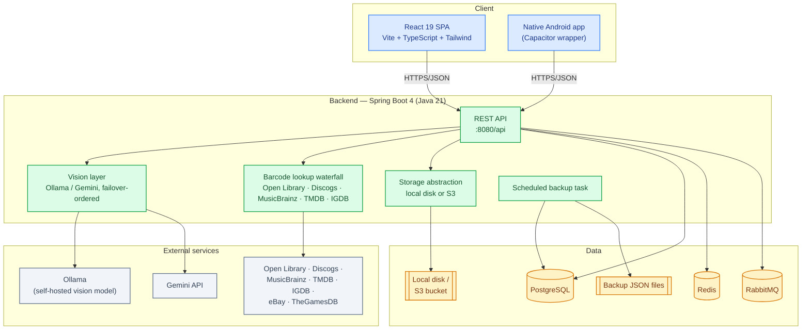
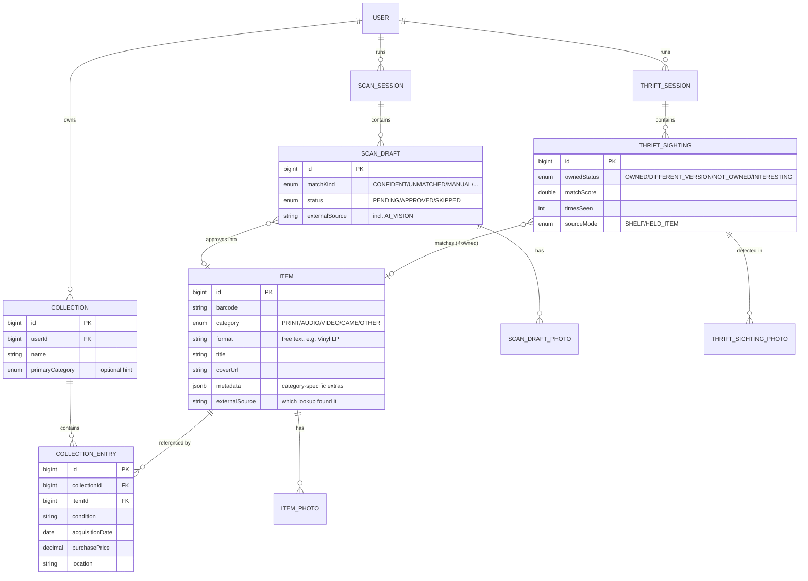
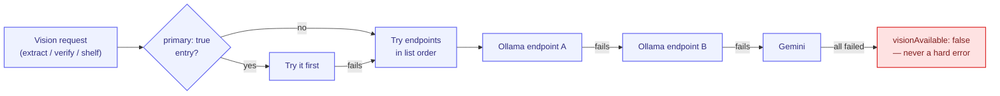
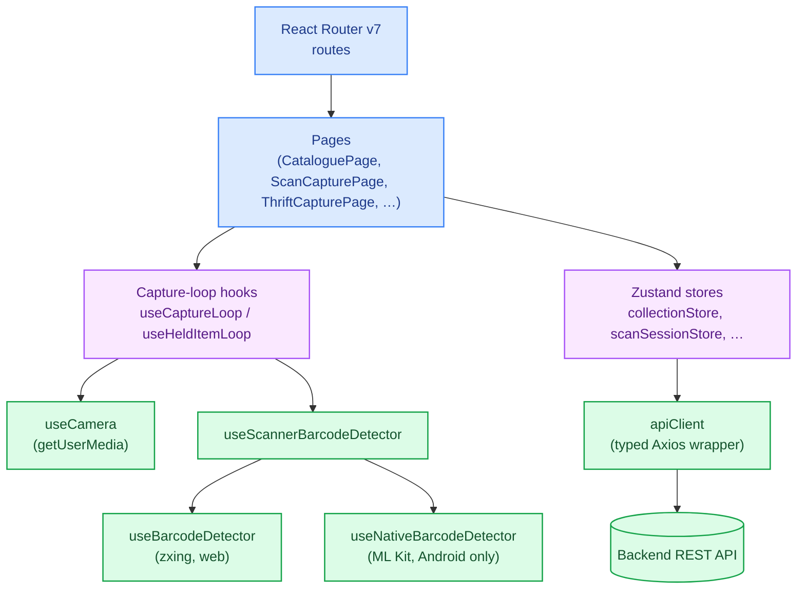

# Architecture

Technical reference for how BOCollections is built. For *why* it's built this way — the product
reasoning behind the features themselves — see [product-overview.md](./product-overview.md).

## System overview



**Backend**: Spring Boot 4 on Java 21. PostgreSQL is the system of record; Redis and RabbitMQ are
provisioned (rate-limit/cache infrastructure and future async work) but the current feature set
leans mostly on Postgres + synchronous HTTP. Photos are never stored in the database — only a
storage key, resolved through a pluggable `StorageService` (local filesystem by default, S3 for
anything beyond a single box).

**Frontend**: React 19 + TypeScript + Vite + Tailwind CSS v4, with Zustand for client state and
React Router v7 for navigation. The same codebase ships two ways: a responsive web SPA, and — via
Capacitor — a native Android app that swaps `getUserMedia` for a real ML Kit barcode scanner and
native camera APIs where hardware access matters.

## Data model



Two design choices worth calling out:

- **Items are shared, catalogue-wide records; Collections are per-user groupings.** The same
  barcode match — even across different users — resolves to the same `Item` row, referenced by
  however many `CollectionEntry` rows point at it. Deleting a collection cleans up items that end
  up with zero references left, but never touches an item another collection still points to.
- **`metadata` is a JSONB catch-all**, not a rigid column-per-field schema. A vinyl record's
  tracklist, a game's platform, a movie's cast and box-office gross, a book's ISBN-13 — none of
  that fits one shared column set across five media categories, so it lives as opaque JSON that
  each source (TMDB, Discogs, AI vision, …) populates with whatever it actually knows.

## Photo galleries

Three parallel photo-gallery implementations — `ItemPhoto`, `ScanDraftPhoto`, `ThriftSightingPhoto`
— follow the same shape (`{id, storageKey/url, angle?, sortOrder, createdAt}`) but different
ownership rules:

| Gallery | Owned by | Angle taxonomy | Notes |
|---|---|---|---|
| `ItemPhoto` | Shared catalogue data (any authenticated user can view) | FRONT/BACK/SPINE/DISC + REFERENCE | REFERENCE = fetched online cover, never user-assignable |
| `ScanDraftPhoto` | The scanning user | Same as `ItemPhoto` | Copied onto `ItemPhoto` rows on approve |
| `ThriftSightingPhoto` | The scanning user | None | Opportunistic shelf/held-item shots; carries a normalized bounding box (`bboxX/Y/W/H`) locating the item within the photo — see [product-overview.md](./product-overview.md#thrifting-mode) |

## Key backend patterns

### Vision provider abstraction with failover

`VisualScanService` builds `OllamaChatModel`/`GoogleGenAiChatModel` clients directly rather than
relying on Spring AI's autoconfiguration, driven by a list-typed `app.vision.endpoints` property:



Each endpoint is `provider: ollama` (default, needs `base-url`) or `provider: gemini` (needs
`api-key`); marking one `primary: true` jumps it to the front of the queue regardless of list
position — useful for "prefer the fast hosted model, fall back to the local one if it's down" or
vice versa. A failed vision call is never surfaced as an error to the end user; every caller
treats "no vision endpoint responded" as a normal, expected outcome (fall back to manual entry).

### Barcode lookup waterfall

```
own catalogue → (ISBN → Open Library)
             or (UPC → Discogs → MusicBrainz → UPCitemdb+TMDB → UPCitemdb+IGDB)
```

Each hit is then enriched with extra cover-art candidates from eBay's Browse API and TheGamesDB
(GAME only) before being handed back. A `ResolvedBarcode` cache (with a TTL on *negative* results
only — a real match is cached forever, a miss might just be a transient upstream outage) means a
repeated scan of the same barcode across sessions, or across users, never re-pays the external
API cost.

### Async, non-blocking AI analysis

Bulk-scan mode's biggest UX-driven backend constraint: **the user must never have to wait for AI
vision to respond before moving to the next item.** A `Batch` token (see
[product-overview.md](./product-overview.md#background-ai-analysis)) tracks which in-progress
item a running analysis belongs to; if the user has already advanced by the time the vision call
resolves, the frontend routes the result into a `PATCH` against the already-created draft instead
of the in-memory findings for whatever item is now on screen.

### Specification-based catalogue filtering

Category/format/genre/year-range/sort compose via Spring Data's `Specification` API — except for
anything that needs to search *inside* the `metadata` JSONB column (genre, free-text search) or
sort by a JSONB field (`REVENUE_HIGHEST`, from a movie's box-office gross). Hibernate's Criteria
API can't cast `jsonb` to text the way a hand-written JPQL query can, so those two paths are
resolved as a plain `id IN (...)` predicate (genre/text) or a full in-memory sort (revenue) instead
of trying to force it through the Specification layer.

## Frontend architecture



`useScannerBarcodeDetector` picks the native ML Kit scanner inside the Android app shell, or the
existing zxing/getUserMedia scanner in a plain browser tab, behind one interface — callers never
branch on platform themselves. The two underlying hooks are always mounted (React's hook-call-order
rules leave no room for conditionally mounting one or the other), but only the active one's
start/pause/resume ever gets invoked.

### Native camera contention (Android)

The native ML Kit barcode scanner and `getUserMedia` are two independent camera clients on
Android — running both at once, or switching between them without a clean handoff, causes real
hardware contention (a black screen requiring an app restart, confirmed on-device). Every capture
flow that needs both a barcode scan and a getUserMedia photo follows the same disciplined sequence:
`pauseDetector()` → `startCamera()` → `captureFrame()` → `stopCamera()` → `resumeDetector()`, with
a ~400ms settle delay around the stop/resume boundary for the OS to actually release the camera.

## Deployment

See [deployment.md](./deployment.md) for the release pipeline, the Proxmox LXC install, and how
the scheduled backup task fits in.
