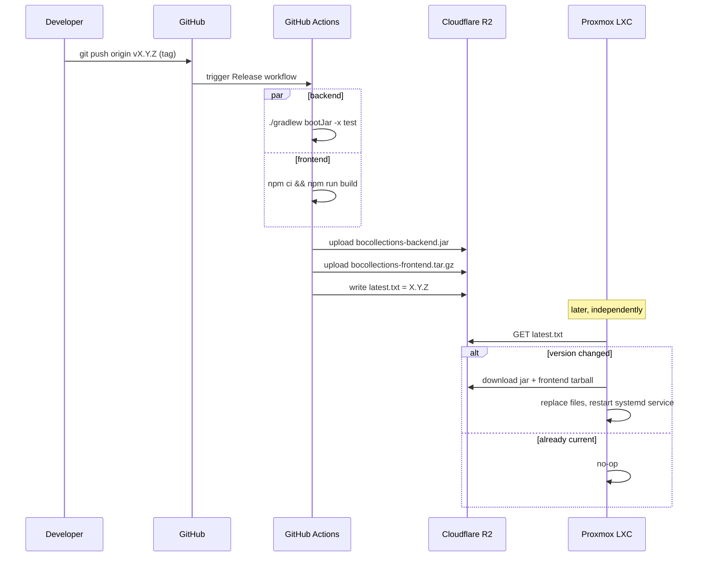
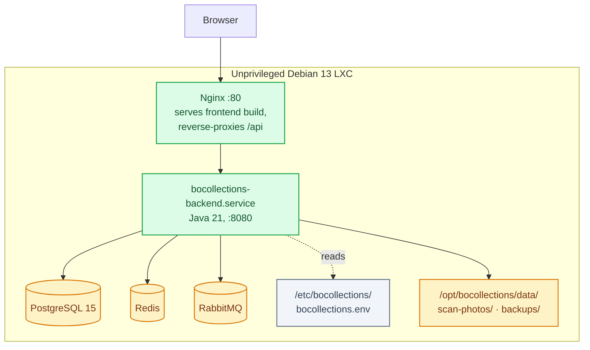
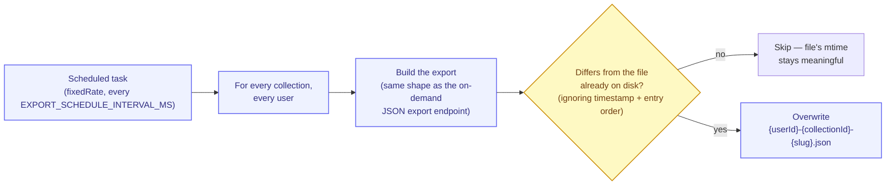

# Deployment

How BOCollections gets from a commit to a running instance, and what to configure once it's up.
For the system's internal architecture, see [architecture.md](./architecture.md).

## Two environments

| | Local dev | Production (Proxmox LXC) |
|---|---|---|
| Infra | `docker compose` (Postgres/Redis/RabbitMQ) | Native `apt` install — no Docker in the LXC |
| Backend | `./gradlew bootRun`, hot-reload via IDE | Pre-built jar, `systemd` service |
| Frontend | Vite dev server, proxies `/api` | Static build served by Nginx, `/api` reverse-proxied |
| Vision AI | Whatever's in `application-local.yml` | Disabled by default — see [Configuration](#configuration) |

Local dev exists to iterate fast against real infrastructure (no mocks — see the project's own
"verify against real integration" convention). Production deliberately avoids Docker-in-LXC: a
single unprivileged Debian 13 container with everything installed natively is lighter and simpler
to operate than nesting a container runtime inside a container.

## Release pipeline



Publishing is **tag-triggered, not push-triggered** — every push to `main` does *not* ship
anything, deliberately, so the LXC update path only ever deploys something explicitly tagged as
shippable:

```bash
git tag v1.2.0 && git push origin v1.2.0
```

Requires three repo secrets (`R2_ACCOUNT_ID`, `R2_ACCESS_KEY_ID`, `R2_SECRET_ACCESS_KEY`) scoped
to an R2 API token for the `bocollections` bucket. R2 speaks the S3 API, so the workflow just uses
the AWS CLI pointed at R2's endpoint — no Cloudflare-specific tooling needed.

## Proxmox VE LXC install

Built on [community-scripts/ProxmoxVED](https://github.com/community-scripts/ProxmoxVED)
conventions (via [this fork](https://github.com/N0t4R0b0t/ProxmoxVED) for the shared framework
functions), run on the Proxmox host itself:

```bash
bash -c "$(curl -fsSL https://raw.githubusercontent.com/N0t4R0b0t/BOCollections/main/ct/bocollections.sh)"
```

The exact same command works for both the first install *and* every later update — it checks R2's
`latest.txt` against what's installed and no-ops if already current.



`ct/bocollections.sh` pre-seeds a throwaway local checkout so the shared ProxmoxVED framework's
own local-file-preference logic resolves the framework half (`misc/*.func`) from the fork above,
and the app-specific install script (`install/bocollections-install.sh`) from this repo — the two
live in different places on purpose, since the framework code is shared across every
community-scripts app, not just this one.

## Configuration

All config is env-var driven — `EnvironmentFile=/etc/bocollections/bocollections.env` on the LXC,
or `application-local.yml` (git-ignored) in local dev. Everything not set falls back to a sane
default; nothing here is required to get a working install with barcode/manual lookup, only AI
vision needs explicit setup.

| Environment variable | Default | Notes |
|---|---|---|
| `VISION_MODEL` | `llava-phi3` | Any Ollama vision model |
| `OLLAMA_BASE_URL` | *(unset — vision disabled)* | Point at any reachable Ollama server |
| `GEMINI_API_KEY` | *(empty)* | Hosted alternative/failover to Ollama |
| `DISCOGS_TOKEN` | *(empty)* | Improves audio barcode lookup |
| `TMDB_API_KEY` | *(empty)* | Enables video metadata |
| `EBAY_CLIENT_ID` / `EBAY_CLIENT_SECRET` | *(empty)* | Real listing photos for VIDEO/GAME — requires a *production* keyset |
| `IGDB_CLIENT_ID` / `IGDB_CLIENT_SECRET` | *(empty)* | GAME title lookup + cover art |
| `THEGAMESDB_API_KEY` | *(empty)* | GAME box art — manual approval required, not instant |
| `EXPORT_SCHEDULE_ENABLED` | `false` (`true` on the LXC install) | Daily backup job — see [below](#backups) |
| `EXPORT_SCHEDULE_INTERVAL_MS` | `86400000` (24h) | Backup interval |
| `EXPORT_SCHEDULE_DIRECTORY` | `./exports` (`/opt/bocollections/data/backups` on the LXC) | Where backup files land |
| `JWT_SECRET` | dev default | **Change this in production** — the LXC installer generates a random one automatically |
| `DB_PASSWORD` | `collections` | Postgres password — also auto-generated on the LXC install |

**Vision AI is disabled by default** on a fresh LXC install — installing a real GPU-backed model
inside the container is its own project. Point `OLLAMA_BASE_URL` at an existing Ollama server on
your network, or set `GEMINI_API_KEY`, then `systemctl restart bocollections-backend`.

## Backups



Photos are embedded as base64 inside each collection's JSON file, so a backup is fully
self-contained — it can be re-imported into a completely different BOCollections instance and
every photo comes back with it, not just a broken link to a storage key that no longer exists
anywhere. See [product-overview.md](./product-overview.md#export--import--backups) for the
product-level reasoning (why JSON *and* Excel, why the change-detection, why it always creates new
items on import rather than trying to merge).

This covers **application data** — items, collections, photos. It does not cover the database
engine itself (users, sessions, thrift sightings, everything the app-level export doesn't touch).
A `pg_dump`-based database backup is a natural complement, not yet implemented.
