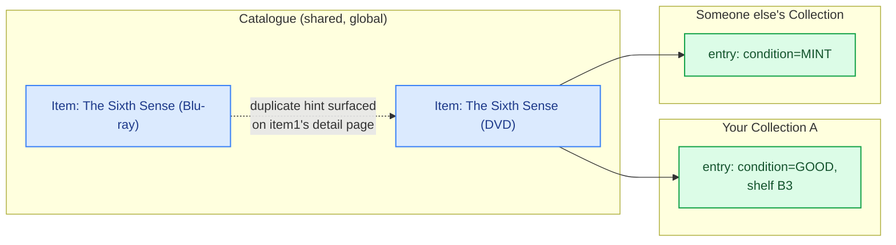
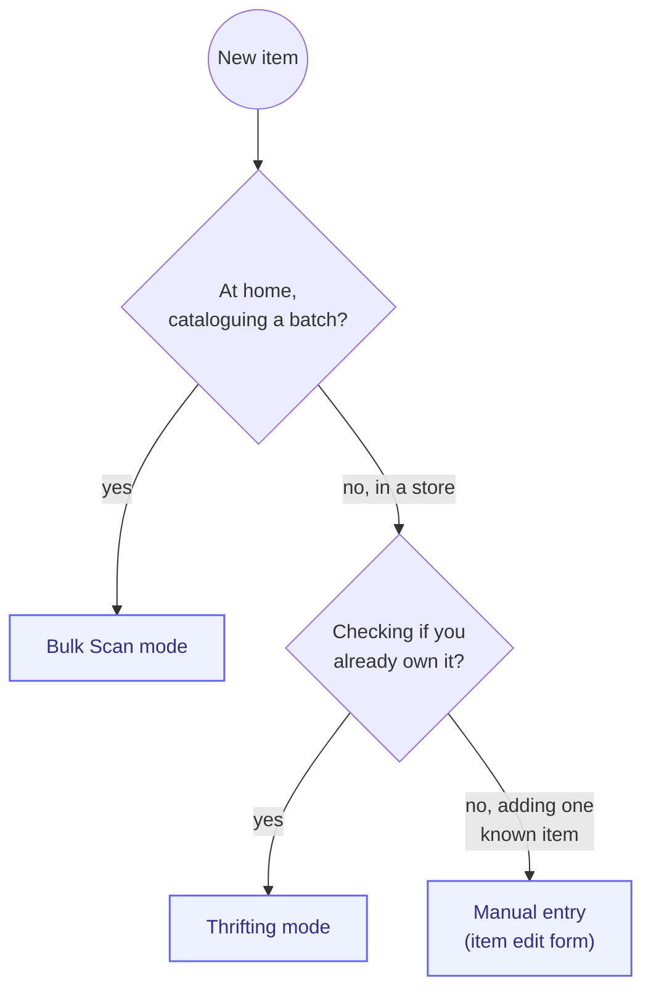
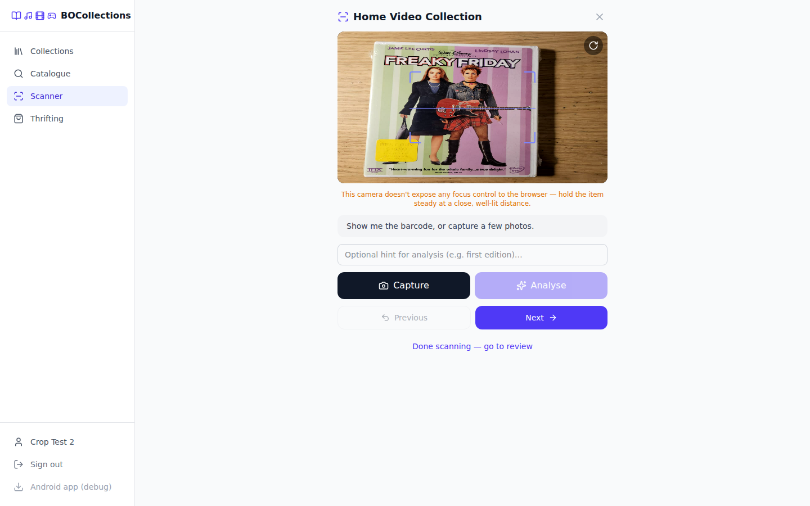
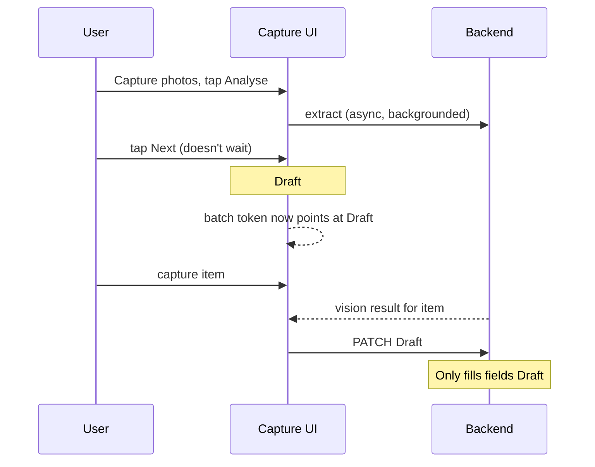
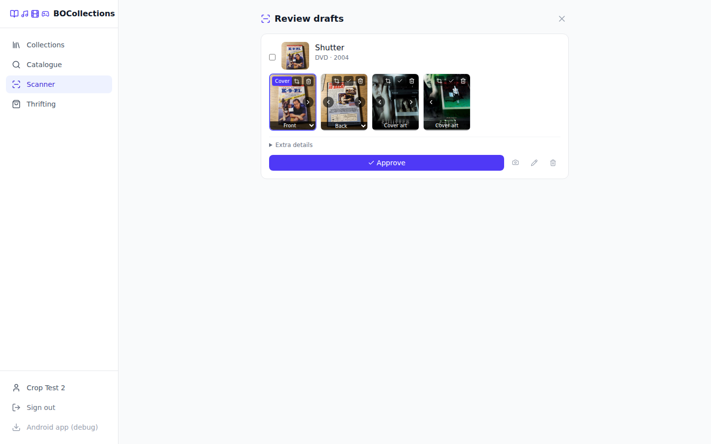
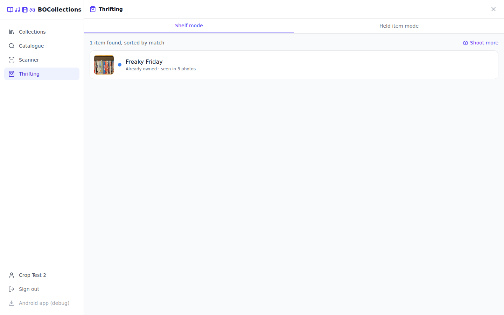
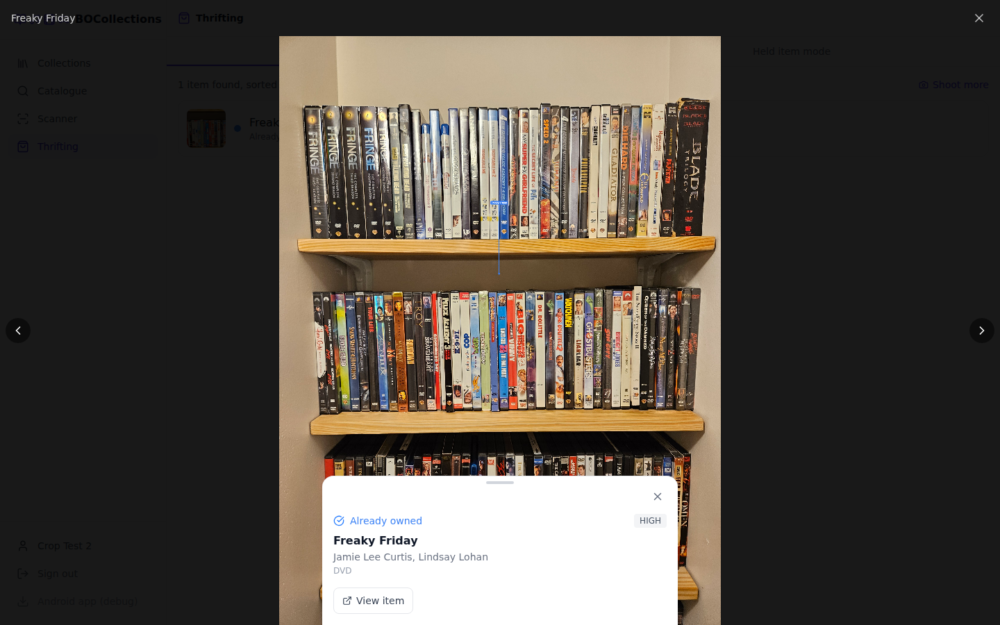
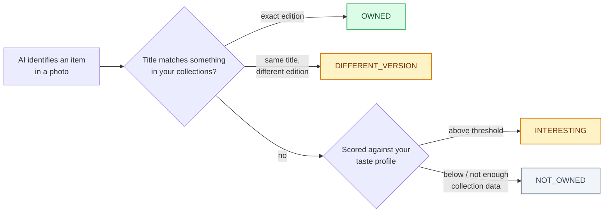
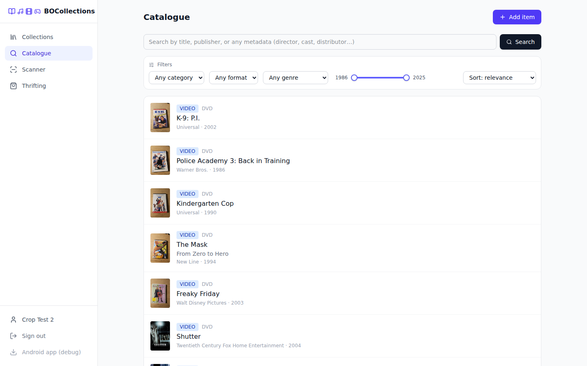

# Product overview

This is the *why* behind BOCollections — the reasoning that shaped each feature, not just what it
does. For the technical how, see [architecture.md](./architecture.md).

## What it is

BOCollections is a self-hosted collection manager for physical media — books, magazines, CDs,
vinyl, cassettes, DVDs, Blu-rays, VHS, video games, and anything else that lives on a shelf. It
exists for a specific kind of collector: someone with enough physical media that "which editions
do I already own" stops being something you can just remember, and who'd rather point a phone
camera at a shelf than type in a spreadsheet.

Two moments drove almost every design decision in this app:

1. **Sitting at home with a box of media to catalogue** — you want speed and thoroughness over
   many items in a row. This is **bulk scan mode**.
2. **Standing in a thrift store with one hand on an item, wondering "do I already own this?"** —
   you want a fast yes/no, not a cataloguing session. This is **thrifting mode**.

Everything else — the catalogue, collections, filters, export — exists to make what those two
modes capture actually useful afterward.

## Core mental model: Catalogue vs. Collections

An **Item** is one record per *edition* — a specific barcode, not a specific physical copy. An
Item lives in the shared catalogue, not owned by any one user. A **Collection** is a named,
per-user group; adding an item to a collection creates a **CollectionEntry** — the actual "your
copy" record, carrying condition, acquisition date, purchase price, and shelf location.

This split matters because two different DVD *pressings* of the same movie are legitimately
different Items (different barcodes, sometimes different special features), but the *same* DVD
scanned twice — once for your "Movies" collection, once because a friend's copy got added to a
shared household collection — should resolve to the *same* Item. Duplicate-edition detection
(`ItemResponse.duplicates[]`) surfaces the "you also have this on Blu-ray" case without treating
it as an error.

## Getting items into a collection

## Bulk scan mode

The deliberate, at-home cataloguing flow: capture several items in a row, each becoming a review
draft you approve into a collection.

### Why session-based, not one-item-at-a-time

An earlier version of this app was a single-item scanner: scan → confirm → done, then start over.
It got replaced with a **session**: open one scan session against a collection, then move through
items with Capture → Analyse → Next, each Next finalizing the current item into a draft and
clearing the screen for the next one. The difference sounds small but changes the actual physical
motion — instead of "pick up phone, scan, put down phone, repeat," it's "keep scanning while a
stack of physical items moves past," closer to how you'd actually process a box.

### Why photos-first, then analyze

Capture doesn't fire AI vision per photo. It collects front/back/spine/disc shots into a queue,
then a single **Analyse** call reads all of them together. Vision models read a lot more off a
box when they see multiple angles at once (edition info on the back, disc count from the tray,
special features from the spine) than they do guessing from one photo — and it means one API call
per item instead of one per photo.

### Background AI analysis

The one AI vision call per item is the slowest step in the whole flow — sometimes tens of seconds.
Early on, **Next** blocked on it: you'd stand there watching a spinner before you could move to
the next item. That's exactly the kind of dead time bulk-scan mode is supposed to eliminate.

A lightweight "batch" token tracks which in-progress item a running analysis belongs to. If the
user has already moved on by the time the result comes back, it gets routed as a background patch
onto the draft that item became — never onto whatever's currently on screen. **Previous** exists
as a safety net on top of this: it restores the most recently finalized draft back into the live
capture screen (destructively — the server-side draft gets discarded and rebuilt from what's
shown), for the case where Next was pressed by mistake or the result needs a correction before
photos are lost from view.

### Review and approve

Every draft shows its match confidence (`CONFIDENT` when a barcode resolved cleanly, `UNMATCHED`
when only AI vision identified it, `MANUAL` when nothing did) and its full photo gallery —
including any cover art pulled from Open Library/TMDB/Discogs, tagged `REFERENCE` and shown
alongside your own captures so you can pick whichever actually matches your copy as the cover.
A manually-captured FRONT photo wins as the default cover over a fetched one, on the theory that a
photo of *your actual copy* is more useful than stock art, while the fetched image stays
available to switch back to.

## Thrifting mode

The in-store flow: fast enough to use standing in an aisle, answering one question — "do I
already own this?" — rather than trying to fully catalogue anything on the spot.

### Shelf mode vs. held-item mode

Two sub-modes exist because "one item in your hand" and "a whole shelf in front of you" are
different problems with different UX shapes, not one flow generalized to cover both badly:

- **Held-item mode**: point-and-scan, one item at a time, closest to bulk-scan mode's rhythm —
  for when you're already holding a specific thing.
- **Shelf mode**: photograph a whole shelf (or several), get back a ranked list of *everything*
  identified in those photos. Built for browsing — walking a store's media section and wanting to
  know, in bulk, what's actually worth a second look.

### An ever-growing, ranked list

Shooting more photos in shelf mode doesn't discard earlier results — each new analysis pass
merges into the running list (deduped by normalized title, re-ranked by match score), so walking
further down an aisle and shooting again just keeps building the same list rather than starting
over. Each result row shows a cropped thumbnail of the item — pulled straight out of its source
shelf photo — so you can browse by "something that catches my eye" instead of reading a wall of
titles.

### Locating an item in its photo

Tapping a result opens its source photo with an arrow pointing at exactly where in frame it was
detected — not a filled box (which, tried first, covered up the very thing being pointed at,
especially bad for something as thin as a DVD spine on a crowded shelf).

### Owned-status matching

Title matching is intentionally conservative — a shelf spine that only has room to show "K-9"
doesn't get auto-matched against a fuller catalogue title like "K-9: P.I.", even though they're
probably the same movie, because guessing wrong here means falsely telling you that you already
own something you don't. The **taste-profile** score (how well an unmatched item's genre/category
mix fits what's already in your collections) is what powers the `INTERESTING` tier — a soft
"you might like this" signal, distinct from the hard yes/no of actual ownership.

## Catalogue & collections

The catalogue's filter set is deliberately **data-driven, not a fixed static list**: format and
genre dropdowns only ever offer values that actually exist somewhere in your collection (scoped to
whichever category is selected), and the year-range slider is bounded by your catalogue's real
min/max release years. A filter that could return zero results by construction doesn't get offered
in the first place.

Sorting includes a `REVENUE_HIGHEST` option (box office gross, when TMDB happened to supply it) —
a small example of the general principle that whatever a source metadata provider knows, the
catalogue tries to make usable rather than letting it sit unused inside the metadata blob.

### Cover images

When an item has no explicit cover set, list views (catalogue, collection grid) fall back to its
first gallery photo rather than showing a blank placeholder — a real photo of the actual item beats
nothing, even if nobody ever explicitly picked it as "the" cover.

## Export, import & backups

Two export formats exist because they serve different purposes, not as redundant options:

- **Excel** is for *looking at* your collection — a real spreadsheet with a styled header, filter
  dropdowns, a frozen header row, one column per metadata key actually present (director, cast,
  genre, runtime, …), and an embedded cover thumbnail per row. Read-only; there's no import path
  back from a spreadsheet, since round-tripping one reliably would need a rigid column contract
  that fights the whole point of per-collection dynamic columns.
- **JSON** is for *moving* your collection — every field, every photo (embedded as base64, not a
  link to a storage key that might not exist on the destination system), a completely
  self-contained file that survives being imported into a different BOCollections instance
  entirely.

Import always creates **new** items rather than trying to merge into the existing catalogue — the
use case is restoring a backup or bringing in someone else's export wholesale, not deduplicating
against what you already have.

The optional **scheduled backup** (off by default; on by default on the Proxmox LXC install) runs
the JSON export automatically on an interval, one file per collection, skipping the write when
nothing's actually changed since the last run — so a file's last-modified time means "when this
collection last changed," not "when the job last happened to run."

## Native Android app

The same frontend ships as a native Android app via Capacitor, for one reason: **real barcode
scanning hardware access**. A browser tab's `getUserMedia` + zxing combination works, but the
native ML Kit scanner is meaningfully more reliable at actually reading a barcode — worth a real
app wrapper rather than asking mobile users to live with the weaker web fallback. See
[architecture.md](./architecture.md#native-camera-contention-android) for how the app avoids the
resulting camera-hardware-contention problems that come with running two camera clients.
